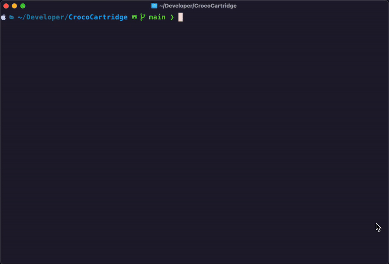
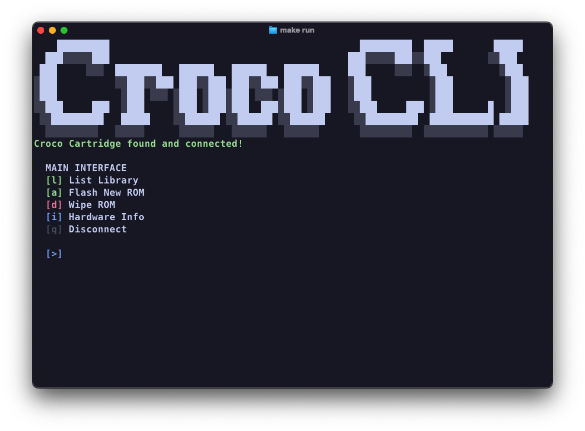
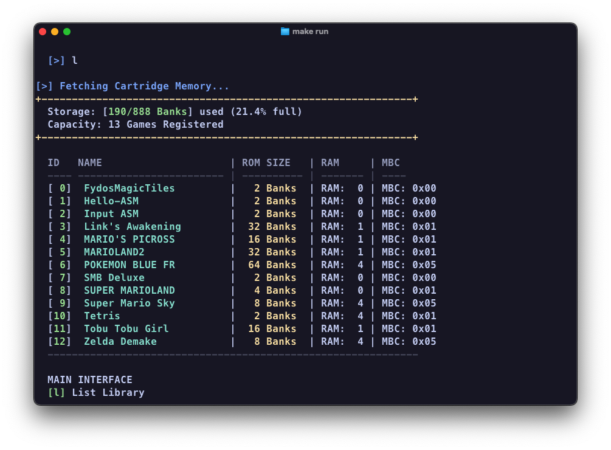

# Croco Cartridge CLI

A command-line interface for interacting with the Croco Game Boy cartridge reader/writer. This tool allows you to manage ROMs, save files, and device information on your Croco cartridge via USB.

## Features

- [x] List Games - View all ROMs currently stored on the cartridge
- [x] Upload ROMs - Write Game Boy ROM files to the cartridge
- [x] Delete Games - Remove ROMs and their associated save files
- [x] Device Info - Display cartridge firmware version and hardware details
- [ ] Save File Management - Download and upload Game Boy save files (SRAM)
- [ ] RTC Support - Fetch and set Real Time Clock data for cartridges with RTC chips

## Images





## Requirements

### Dependencies

- `libusb-1.0` - USB library for device communication
- GCC compiler
- pkg-config

### Installation

**macOS (with Homebrew):**

```bash
brew install libusb pkg-config
```

**Debian/Ubuntu**

```bash
sudo apt-get install libusb-1.0-0-dev pkg-config
```

**Fedora**

```bash
sudo dnf install libusbx-devel pkg-config
```

**Arch Linux**

```bash
sudo pacman -S libusb pkg-config
```

**Alpine Linux**

```bash
sudo apk add libusb libusb-dev pkg-config
```


## Building

```bash
make
```

This will create the `croco_cli` executable in the `build/` directory.

### Build Options

The Makefile includes support for Homebrew installations on macOS. Adjust `HOMEBREW_PREFIX` if your installation is in a different location.

## Usage

### Interactive Mode

Run the program without arguments to enter interactive menu mode:

```bash
./build/croco_cli
```

or use :

```bash
make run
```

The menu provides the following options:

- **`l`** - List all games on cartridge
- **`a`** - Add/upload a new ROM
- **`d`** - Delete a ROM by ID
- **`i`** - Display device information
- **`q`** - Quit

### Uploading a ROM

When selecting the upload option, you will be prompted for:

1. **Path to ROM file** - Full or relative path to a `.gb` or `.gbc` file
2. **Display name** - Custom name for the game (max 17 characters)

Example:

```txt
[?] Enter path to ROM file (or 'EXIT'): roms/Snake.gb
[?] Enter display name (max 17 chars): Snake

[>] Initializing Data Stream...
    Target:  Snake
    Size:    32768 bytes (2 banks)

[+] Handshake successful. Uploading data...

    Writing Bank: [2/2] ...

=================================================
    SUCCESS: ROM flashed to cartridge memory!
=================================================
```

The cartridge will calculate the required number of banks (16KB banks) and transfer the ROM in 32-byte chunks. A progress indicator shows the current bank being written.

### Deleting a ROM

Select the delete option and enter the ROM ID (shown in the game list):

```txt
[!] DANGER ZONE
    [-] Enter ROM ID to wipe (or type 'EXIT'):
```

This will remove both the ROM and its associated save file.

### Listing Games

Displays all games currently on the cartridge with the following information:

- ROM ID number
- Game name
- ROM size (in 32KB banks)
- RAM size (in 8KB banks)
- MBC type (cartridge hardware type)

Example output:

```txt
  ID   NAME                     | ROM SIZE   | RAM     | MBC
  ---- ------------------------ | ---------- | ------- | ----
  [ 0]  FydosMagicTiles         |   2 Banks  | RAM:  0 | MBC: 0x00
  [ 1]  Hello-ASM               |   2 Banks  | RAM:  0 | MBC: 0x00
  [ 2]  Input ASM               |   2 Banks  | RAM:  0 | MBC: 0x00
```

## Protocol Reference

The Croco cartridge communicates via USB using a custom command protocol. Commands are sent to the device and responses are echoed back.

### Commands

| ID (Hex) | Command | Description | Response |
| ---------- | --------- | ------------- | ---------- |
| `0x01` | readRomUtilization | Query flash memory state | `numRoms`, `usedBanks`, `maxBanks` |
| `0x02` | requestRomUpload | Prepare cartridge for ROM transfer | `status` (0 = OK) |
| `0x03` | sendRomChunk | Send 32-byte ROM data chunk | `status` |
| `0x04` | readRomInfo | Get ROM metadata | `romId`, `name`, `numRamBanks`, `mbc`, `numRomBanks` |
| `0x05` | deleteRom | Delete ROM and save file | `status` |
| `0x06` | requestSaveDownload | Prepare save file for download | `status` |
| `0x07` | receiveSaveChunk | Receive 32-byte SRAM chunk | `bank`, `chunk`, `data` |
| `0x08` | requestSaveUpload | Prepare for save file import | `status` |
| `0x09` | sendSavegameChunk | Send 32-byte SRAM chunk | `status` |
| `0x0A` | fetchRtcData | Fetch Real Time Clock data | `rtcData` (49 bytes) |
| `0x0B` | sendRtcData | Set Real Time Clock data | `status` |
| `0xFD` | readDeviceSerialId | Get RP2040 UUID | `serialId` (8 bytes) |
| `0xFE` | readDeviceInfoCommand | Get firmware version and hardware info | `hwVersion`, `swVersion`, `gitShort`, `gitDirty` |

### Bank Calculation

Based on the real webapp [https://cartridge-web.croco-electronics.de/](https://cartridge-web.croco-electronics.de/) a bank is the `numbers of bytes / 256` ex: `48640 bytes / 256 = 190 banks`

Note: The web interface displays banks differently due to a different bank size calculation. Refer to the [official Croco webapp](https://cartridge-web.croco-electronics.de/) for reference.

## Troubleshooting

### Connection Issues

**"Croco Cartridge not found"**

- Ensure the cartridge is properly connected via USB
- Check that no other application (like the web interface) is accessing the device
- Try disconnecting and reconnecting the USB cable
- On Linux, you may need to run with `sudo`

**"No response from device"**

- Close any running Croco web apps
- Disconnect and reconnect the cartridge
- Try running with `sudo`
- Power cycle the cartridge

**"Failed to detach kernel driver"**

- Another application is using the device
- Close the Croco web interface
- Run the command with `sudo`

### Upload Issues

**Upload fails mid-transfer**

- Ensure the ROM file is not corrupted
- Try uploading to a fresh cartridge by deleting other ROMs first
- Check available cartridge storage with the "List Games" option

**ROM appears corrupted after upload**

- Use only validated Game Boy ROM files
- Verify the file size is correct (typically 32KB-8MB)
- Try deleting and re-uploading the ROM

## Development

### Source Code Structure

- `src/main.c` - Main program, device communication, and command implementations
- `build/` - Compiled output directory

### USB Communication Flow

1. Initialize libusb and locate device (Vendor: 0x2E8A, Product: 0x107F)
2. Claim USB interface and configure endpoints
3. Send commands with 1-byte command ID + payload
4. Receive responses (command echo + data)
5. All multi-byte values use big-endian byte order

## References

- Web Interface: https://cartridge-web.croco-electronics.de/
- JavaScript Implementation: https://github.com/shilga/croco-cartridge-webapp
- libusb Documentation: https://libusb.info/

## 👀 🫵 ⏭️ ⏰ ヾ(＾ ∇ ＾).

### Boring stuff

This project is released under the [Unlicense](./UNLICENSE).

Read more on [my blog](https://wirenux.github.io)

Credit:

- [Shilga](https://github.com/shilga)
- [rp2040-gameboy-cartridge-firmware](https://github.com/shilga/rp2040-gameboy-cartridge-firmware/tree/master)
- [croco-cartridge-webapp](https://github.com/shilga/croco-cartridge-webapp)

**Developed with ❤️ & 💪 by [@wirenux](https://github.com/wirenux)**
